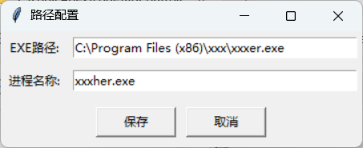

**项目说明**‌本工具为教学演示程序，用于学习Windows系统下的进程强制终止与窗口层级管理技术。严禁用于非法用途。

------

## 核心功能

✅ ‌**窗口置顶解除**‌破解强控制类软件的霸屏行为，恢复窗口正常层级

✅ ‌**顽固进程终止**‌强制结束任务管理器无法关闭的进程

------

## 配置指南（默认适配某云控软件）

### 基础配置

1. 定位目标进程：

   > - 任务管理器 → 选中进程 → 右键【打开文件所在位置】

1. 设置参数：

   > - 系统托盘右键 →【配置】
   >
   > - 安装路径：C:\Program Files\TargetSoftware\main.exe（需完整路径）
   >
   > - 进程名称：target_process.exe
   >
   >   
   >
   > 

------

## 应急处理方案（被控屏时）

### 方案A：系统快捷键突破

1. 连续单击【Shift】×5 触发粘滞键
2. 立即按下【Win】键调出开始菜单
3. 通过系统托盘图标恢复控制（需实践掌握）

### 方案B：物理断网

直接断开网络连接阻断远程控制

------

## 技术原理

- 适用大部分采用Windows API的GUI程序
- 基于进程句柄操作与窗口属性修改
- 依赖系统管理权限执行

------

## 重要警告

⚠ 强制终止进程可能导致：

- 数据丢失
- 系统不稳定
- 安防软件告警

建议在虚拟机环境测试，操作前保存工作进度。

------

## 扩展学习

可通过Python这些库深入开发：

- psutil 进程管理
- win32gui 窗口控制
- ctypes 系统级操作